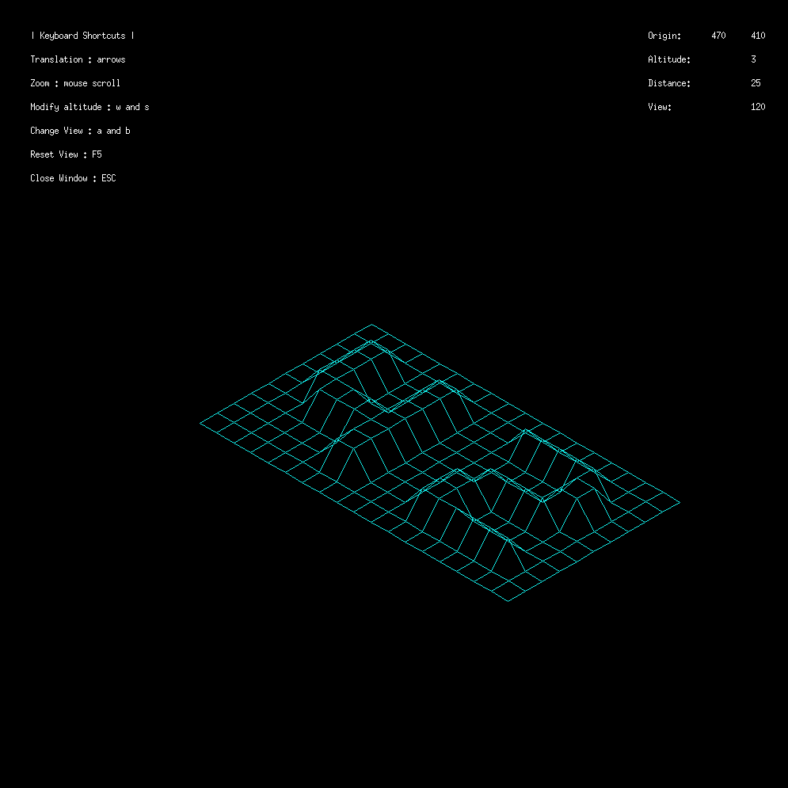
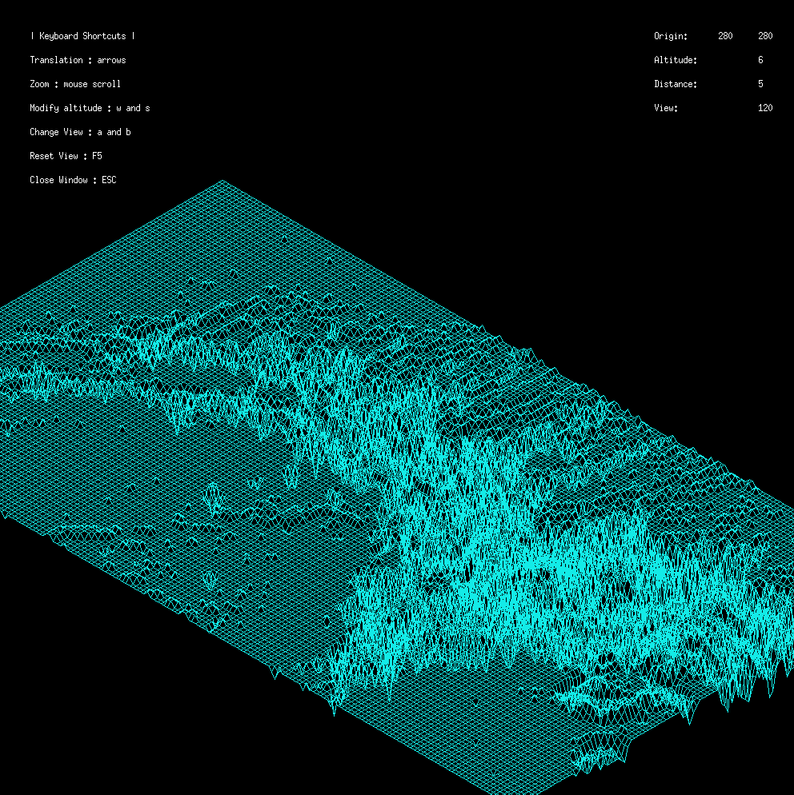
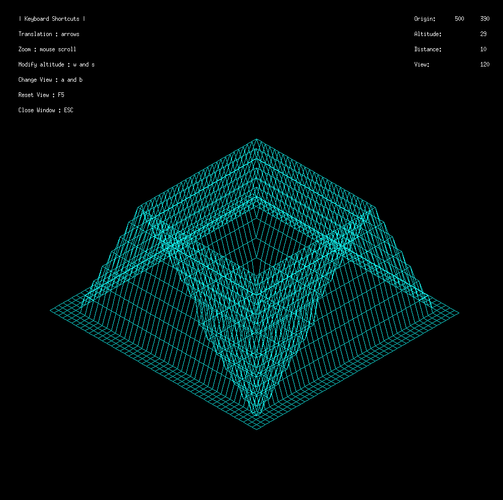
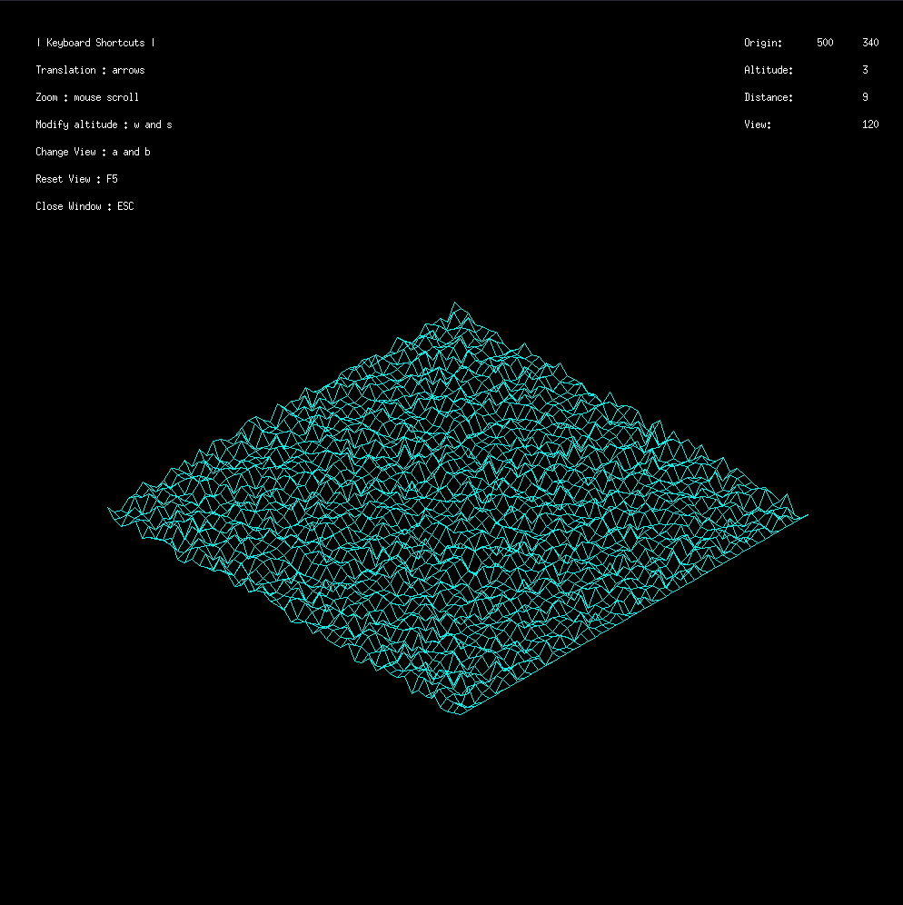
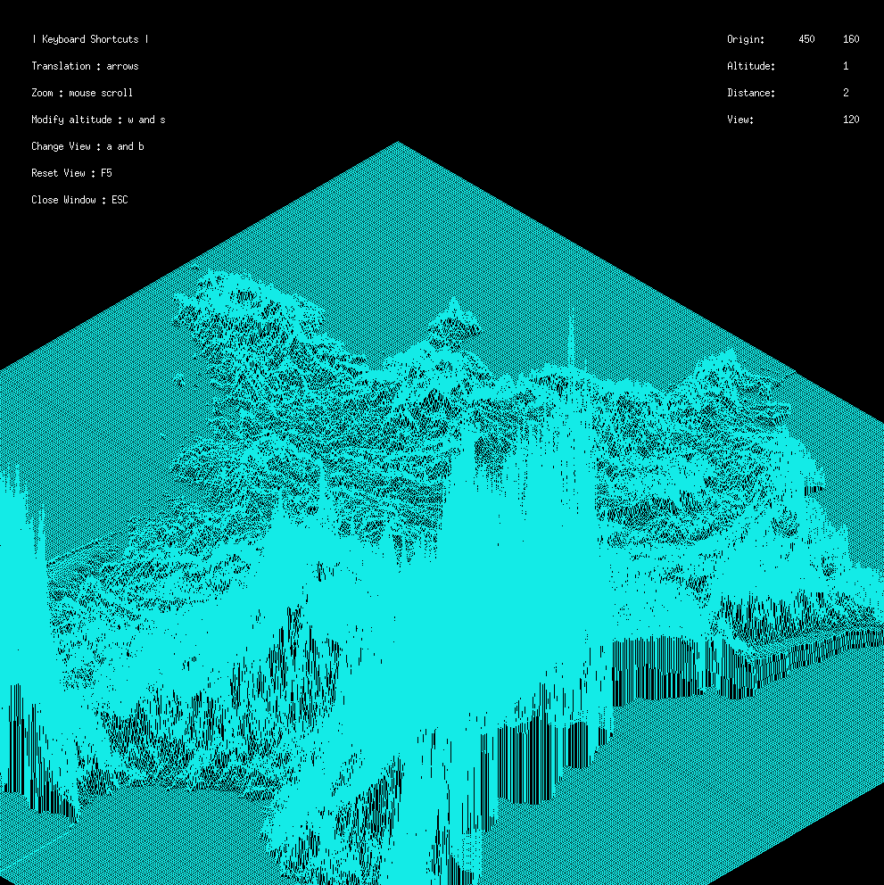

# FDF Project

_FDF is short for ’fil de fer’ in French which means ’wireframe model’._

The goal of this project is to create a 3D wireframe model of a landscape given a file containing the altitude of each point.

The wireframe is projected onto a 2D plane using an isometric projection.


## Compatibility

- MacOs
- Linux

## Tech Stack

- C language
- Minilibx (42 graphic lib)

## Get Started
```
make
./fdf maps/42.fdf
```

## Examples

**- 42 Model -**


**- Mars Model -**


**- Pylone Model -**


**- Simple Map Model -**


**- France Model -**

